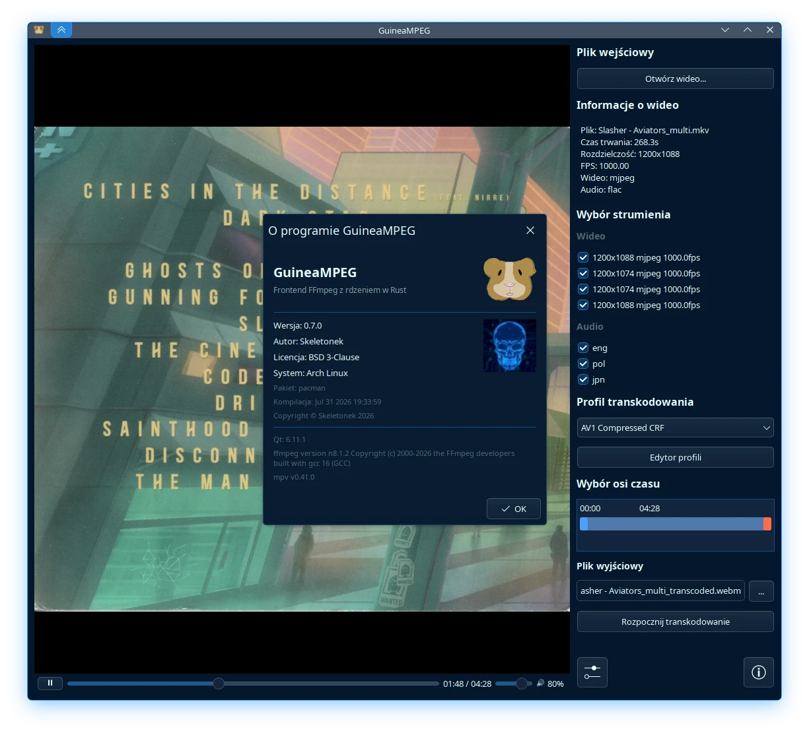

#  GuineaMPEG

FFmpeg transcoding GUI using Qt QML with a Rust core library dynamically linked via C FFI.



> [!NOTE]
> This project main git hosting site is [gitlab.com](https://gitlab.com/Skeletonek/guinea-mpeg-qt/); Pull requests or Issues created on other mirrors, such as github.com, may be ignored by the authors

## Features

- **Video Preview with Playback**: Load any video via embedded libmpv
- **Timeline Selection**: Drag start/end handles to select a segment for transcoding
- **Transcoding Profiles**: Built-in profiles for H.264, H.265/HEVC, VP9, AV1, GIF, and WebP
- **Hardware Encoding**: Runtime detection of NVENC, QSV, VAAPI, AMF, Vulkan encoders via ffmpeg
- **Profile Editor**: Create, edit, and delete profiles in-app
- **MIME type integration**: Open video files directly from your file manager
- **Drag & Drop**: Drop a video file anywhere on the window to load it

## Download

Linux x86_64 and aarch64 packages are available to download through [releases page](https://gitlab.com/Skeletonek/guinea-mpeg-qt/-/releases)

Windows x86_64 and Linux x86_64 appimage is built outside this repository, and downloads are available through [my website](https://www.skeletonek.com/apps/guinea-mpeg/#download)

Windows aarch64 and Linux aarch64 appimage requires manual building

## Building

### Build Requirements

#### Linux
- CMake 3.16+
- GCC 11+ (C++20 required)
- Rust 1.56+ (use your distro's `cargo`/`rustc` packages)
- Qt 6.5+
- libmpv-dev
- OpenGL / GLX development headers
- FFmpeg + ffprobe runtime

**Debian / Ubuntu**
```bash
sudo apt install cmake g++ pkg-config cargo \
                 qt6-base-dev qt6-declarative-dev qt6-multimedia-dev qt6-tools-dev \
                 qml6-module-qtmultimedia qml6-module-qtquick-controls \
                 libmpv-dev libgl1-mesa-dev
```

**Fedora**
```bash
sudo dnf install cmake gcc-c++ pkgconf-pkg-config cargo rust \
                 qt6-qtbase-devel qt6-qtdeclarative-devel \
                 qt6-qtquickcontrols2-devel qt6-qtmultimedia-devel qt6-qttools-devel \
                 mpv-libs-devel mesa-libGL-devel
```

**Arch Linux**
```bash
sudo pacman -S --needed base-devel cmake \
                       qt6-base qt6-declarative qt6-multimedia qt6-tools \
                       mpv rust cargo
```

#### Windows
- CMake 3.16+
- Visual Studio 2022 with **Desktop development with C++** workload
- Rust 1.56+ with MSVC toolchain:
  ```powershell
  rustup toolchain install stable-msvc
  rustup default stable-msvc
  rustup target add x86_64-pc-windows-msvc
  ```
- Qt 6.5+ for MSVC 2022 — required components:
  - `Qt 6.x / MSVC 2022 64-bit`
  - `Qt Quick`
  - `Qt QuickControls2`
- 7-Zip (required by the mpv-dev download script): `winget install 7zip.7zip`
- Ninja (optional, auto-detected): `winget install Ninja-build.Ninja`
- InnoSetup 6.3+ (optional, for installer) — download from [jrsoftware.org](https://jrsoftware.org/isdl.php)

For building **Windows on ARM (ARM64)** on x86 hosts you need to additionally install:
- The `MSVC v143 - VS 2022 C++ ARM64 build tools` component in the VS 2022 installer
- The Qt **`win64_msvc2022_arm64`** package (Qt 6.x for MSVC 2022 ARM64)
- `rustup target add aarch64-pc-windows-msvc`

### How to build

#### Linux

For quick development build use the prepared script

```bash
./build/linux-build.sh                              # build to out/generic/
```

The `build/linux-build.sh` script supports Docker-based cross-distro packaging:

```bash
./build/linux-build.sh --package generic            # build + .tar.gz
./build/linux-build.sh --package deb,rpm,pacman     # Docker build + .deb + .rpm + .pkg.tar.zst
./build/linux-build.sh --package flatpak            # flatpak-builder build
./build/linux-build.sh --package appimage           # Docker build + .AppImage
./build/linux-build.sh --package all                # all targets
./build/linux-build.sh --clean --package deb        # clean + rebuild + .deb
./build/linux-build.sh --release --package deb      # optimized Release build (strips debug info)
./build/linux-build.sh --help                       # show all possible parameters
```

Output goes to `out/{target}/` — e.g. `out/deb/`, `out/appimage/`.

##### ARM64 (Linux)

Pass `--arch aarch64` to build for ARM64 on x86_64 hosts. `generic`, `deb` and `rpm` build in
Docker with `--platform linux/arm64` and emit artifacts to `out/<target>-aarch64/`.
On an x86_64 host this needs Docker **buildx** and QEMU binfmt registration:

```bash
docker run --privileged --rm tonistiigi/binfmt --install arm64
./build/linux-build.sh --arch aarch64 --package deb,rpm
```

**pacman**, **appimage** and **flatpak** are not supported for aarch64 cross-builds -
build those on a native ARM64 host.

#### Windows

Open **x64 Native Tools Command Prompt for VS 2022** (or any PowerShell where `cl.exe` and `nmake` are available from PATH), then:

Optionally run `.\build\download-vendor.ps1` first to fetch the mpv-dev bundle and ffmpeg (the build script does this automatically so it's not necessary).

Use `.\build\download-vendor.ps1 -Arch arm64` to fetch arm64 bundles

```powershell
.\build\windows-build.ps1                           # build to out/windows/
.\build\windows-build.ps1 -Package                  # build + ZIP + InnoSetup installer
.\build\windows-build.ps1 -Arch arm64               # build for Windows on ARM
.\build\windows-build.ps1 -Arch arm64 -Package      # arm64 ZIP + installer
.\build\windows-build.ps1 -Clean                    # full rebuild
.\build\windows-build.ps1 -Console                  # build with visible console (for debugging)
.\build\windows-build.ps1 -Config RelWithDebInfo    # debug symbols enabled
.\build\windows-build.ps1 -Help                     # show all possible parameters
```

| Artifact | Path |
|----------|------|
| Executable | `out/windows/guinea-mpeg.exe` |
| Portable ZIP | `out/guinea-mpeg-{version}-x86_64.zip` (or `-arm64`) |
| Installer (exe) | `out/guinea-mpeg-{version}-x86_64.exe` (or `-arm64`) |

## CI/CD

A GitLab CI pipeline (`.gitlab-ci.yml`) runs lint and format checks on every push.
It also handles builds and releases for all linux packages (except Appimage) on tag using Docker-in-Docker.

## Project Structure

```
.
├── rust/                    # Rust core library (cdylib)
│   ├── include/guinea_mpeg_core.h    # C FFI header
│   └── src/                 # backend FFI, TOML config, mpv, ffmpeg
├── src/                     # C++ glue (QObjects exposed to QML)
│   ├── main.cpp
│   ├── backend.{h,cpp}
│   └── mpvitem.{h,cpp}
├── qml/                     # Qt Quick UI
│   ├── main.qml
│   ├── ProfileEditor/       # components for ProfileEditor.qml
│   ├── Components/          # reusable controls
│   ├── Dialogs/             # modal dialogs
│   └── Utils/               # JS helpers
├── build/                   # build scripts + utils + Dockerfiles
├── translations/            # .ts locale files
├── default_profiles.toml    # default profiles bundled with the app
├── CMakeLists.txt
└── .gitlab-ci.yml
```

- **Rust core** (`rust/`): all business logic, compiled to `libguinea_mpeg_core.so` — profile config/merge, mpv control, ffmpeg command building and encoder detection. Exposes a hand-written C API (`rust/include/guinea_mpeg_core.h`); data crosses the FFI boundary as JSON strings.
- **C++ glue** (`src/`): thin `QObject`s (`GuineaMpegBackendExt`, `MpvItem` + renderer) registering into QML as `GuineaMpeg 1.0`. Only the transcode `QProcess` lifecycle lives in C++ — everything else delegates to Rust.
- **QML** (`qml/`): the entire UI — main window, video preview, timeline trimming, profile editor and dialogs.

## Configuration

All user settings live in `~/.config/guinea-mpeg/config.toml` or `%APPDATA%/guinea-mpeg/config.toml`. It stores both user profiles and application config

Built-in defaults profiles are bundled at `default_profiles.toml` (next to the binary or at `/usr/share/guinea-mpeg/default_profiles.toml`).
User profiles merge over defaults (same name = user override).

### Built-in Profiles

| Profile | Codec | Quality |
|---------|-------|---------|
| H.264 High | libx264 | CRF 18, slow preset, film tune, 1080p |
| H.265 High | libx265 | CRF 22, slow preset, film tune, 1080p |
| H.265 Medium | libx265 | CRF 28, medium preset, film tune, 720p |
| VP9 Low | libvpx-vp9 | CRF 40, deadline=good, cpu-used=3, ssim tune, 720p |
| VP9 Medium | libvpx-vp9 | CRF 32, deadline=good, cpu-used=2, ssim tune, 720p |
| AV1 High | libsvtav1 | CRF 28, preset 6, VMAF tune, native res, tiles 2x3 |
| AV1 Medium | libsvtav1 | CRF 35, preset 6, VMAF tune, 720p, tiles 1x2 |
| AV1 Low | libsvtav1 | CRF 42, preset 6, VMAF tune, 720p |
| Animated GIF | gif | 480p, 10 fps, quality 75, loop |
| Animated WebP | libwebp_anim | 480p, 10 fps, quality 75, loop |

## LLM Usage

This project uses AI to help generate code, and a significant portion of the codebase is AI-generated. However, reviews and quality testing are done entirely by a human. New features are also planed by human with the help of AI to best suit the current project codebase.